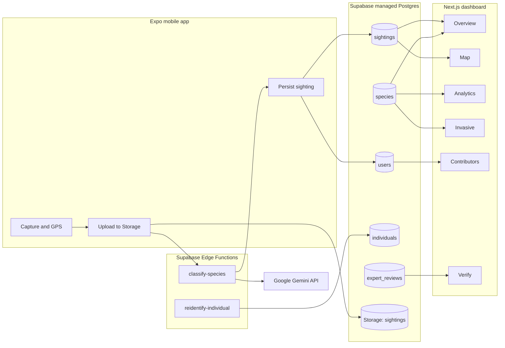

# WildTrace

A field-grade biodiversity intelligence platform. Citizen scientists capture wildlife with the mobile
app; species are identified by Gemini through a Supabase Edge Function; sightings flow into Postgres
where a Next.js dashboard turns them into live maps, leaderboards, invasive watch-lists, and analytics.

WildTrace is a **pnpm + Turborepo monorepo** containing two apps (Expo mobile, Next.js web), three
shared packages (`shared-types`, `shared-utils`, `config`), and a Supabase backend (migrations,
seeds, edge functions).

---

## Table of contents

1. [Overview](#overview)
2. [Architecture](#architecture)
3. [Repository layout](#repository-layout)
4. [Tech stack](#tech-stack)
5. [Prerequisites](#prerequisites)
6. [Quick start](#quick-start)
7. [Environment variables](#environment-variables)
8. [Supabase setup](#supabase-setup)
9. [Running the apps](#running-the-apps)
10. [Test account and seeded data](#test-account-and-seeded-data)
11. [Database schema](#database-schema)
12. [Edge functions](#edge-functions)
13. [Shared packages](#shared-packages)
14. [Common scripts](#common-scripts)
15. [Conventions](#conventions)
16. [Troubleshooting](#troubleshooting)
17. [Privacy and safety](#privacy-and-safety)
18. [Roadmap](#roadmap)

---

## Overview

WildTrace exists to turn ordinary phones into structured biodiversity sensors. The product loop is:

1. **Capture** — A user opens the mobile app, the camera grabs a frame, and GPS pins coordinates.
2. **Upload** — The image is stored in a private `sightings` Supabase Storage bucket. A short-lived
   signed URL is generated for downstream consumers.
3. **Classify** — A Supabase Edge Function (`classify-species`) calls Google Gemini with the image
   plus contextual metadata and returns a structured species payload.
4. **Persist** — The mobile client writes the sighting + species rows to Postgres. Profile XP is
   updated for gamification.
5. **Aggregate** — The Next.js dashboard reads from Postgres for live maps, contributor leaderboards,
   invasive monitoring, expert review queues, and rarity analytics.
6. **(Optional) Re-identify** — For eligible taxa (large mammals, sea turtles, some trees), the
   `reidentify-individual` function is the placeholder for a CLIP/DINOv2 + Qdrant pipeline that
   matches individuals across sightings.

Public maps obfuscate exact coordinates so endangered nests and dens are never leaked.

---

## Architecture



Hard rules baked into the architecture:

- Gemini is only ever called from the edge function. The browser and mobile clients never see the
  Gemini API key.
- Mobile clients write only their own sightings (`sightings_insert_own` RLS).
- Storage is private; clients exchange signed URLs.
- Public coordinates on the web map are passed through `obfuscatePublicCoordinate` before render.

---

## Repository layout

```
WildTrace/
  apps/
    mobile/                      Expo Router app (iOS, Android, RN web)
      app/                       File-based routes (sign-in, (tabs), modal)
      components/                AuthGate and themed primitives
      lib/                       Supabase client, session, classification, store
      providers/                 React Query provider
      metro.config.js            Custom resolver for hoisted pnpm deps
      app.json                   Expo manifest (camera + location plugins)
    web/                         Next.js 16 dashboard with Tailwind v4
      app/                       App Router pages
      components/                Dashboard shell + biodiversity-map + shadcn UI
      lib/supabase/              Browser Supabase client
  packages/
    shared-types/                TypeScript record types shared everywhere
    shared-utils/                Re-ID eligibility, rarity derivation, coord obfuscation
    config/                      Environment key constants and storage bucket names
  supabase/
    migrations/                  SQL migrations (schema, RLS, dev policies)
    functions/
      classify-species/          Gemini-backed Edge Function
      reidentify-individual/     Placeholder for Qdrant re-ID
    seed.sql                     Two-row demo seed
    seed_test_user.sql           Creates test@wildtrace.app for the mobile app
    seed_synthetic_data.sql      ~80 sightings + decoy contributors for the dashboard
    config.toml                  Supabase CLI config
  .env.example                   Canonical env template
  pnpm-workspace.yaml            Workspace declaration
  turbo.json                     Turborepo task graph
```

---

## Tech stack

**Mobile (`apps/mobile`)**

- Expo SDK 54, React Native 0.81, React 19, Expo Router 6 (file-based routing)
- `expo-camera` for capture, `expo-location` for GPS
- `@supabase/supabase-js` with `@react-native-async-storage/async-storage` for session persistence
- React Native polyfills (`react-native-get-random-values`, `react-native-url-polyfill`)
- TanStack Query for data fetching, Zustand for ephemeral last-scan state
- A custom `metro.config.js` to navigate pnpm hoisting in a monorepo

**Web (`apps/web`)**

- Next.js 16 (App Router), React 19, Tailwind v4, shadcn-style primitives
- `@supabase/ssr` and `@supabase/supabase-js` for data access
- `mapbox-gl` + `@turf/turf` for clustering and the live biodiversity map
- `recharts` for analytics

**Backend**

- Supabase (managed Postgres, Auth, Storage, Edge Functions)
- Deno runtime for edge functions, Google Gemini for vision
- Qdrant (planned) for embedding-based individual re-identification

**Tooling**

- pnpm 10 workspaces, Turborepo 2, TypeScript 5, ESLint 9 (web), Expo TS preset (mobile)

---

## Prerequisites

- **Node.js** 20 LTS or newer
- **pnpm** 10.11 or newer (`corepack enable` will pin the right version automatically)
- **Supabase account** with a project (free tier is fine)
- **Google AI Studio key** for Gemini (used only by the edge function)
- **Mapbox access token** (web map only)
- **Supabase CLI** for local edge-function development and deploys (optional but recommended)
- **Expo Go** on a physical device, or an Android emulator / iOS simulator for the mobile app
- **Git** and a working PowerShell / bash terminal

---

## Quick start

```bash
git clone https://github.com/<you>/WildTrace.git
cd WildTrace

corepack enable
pnpm install
```

`pnpm install` runs `postinstall`, which builds the shared `packages/*` so the apps can import them.

Copy the env template into both apps and fill in real values:

```bash
cp .env.example apps/web/.env.local
cp .env.example apps/mobile/.env
```

Run everything in parallel:

```bash
pnpm dev
```

Or run a single workspace:

```bash
pnpm --filter web dev
pnpm --filter mobile dev
```

If this is your first run against a fresh Supabase project, follow [Supabase setup](#supabase-setup)
first.

---

## Environment variables

The canonical list lives in `.env.example`. Copy it into the correct files (Next.js wants
`apps/web/.env.local`, Expo wants `apps/mobile/.env`).

| Variable                          | Used by               | Description                                                                  |
| --------------------------------- | --------------------- | ---------------------------------------------------------------------------- |
| `NEXT_PUBLIC_SUPABASE_URL`        | web                   | Project URL from Supabase dashboard.                                         |
| `NEXT_PUBLIC_SUPABASE_ANON_KEY`   | web                   | Anon JWT. Browser client only; never the service role key.                   |
| `NEXT_PUBLIC_MAPBOX_TOKEN`        | web                   | Default public Mapbox token for the biodiversity map.                        |
| `EXPO_PUBLIC_SUPABASE_URL`        | mobile                | Same project URL, prefixed for Expo public env.                              |
| `EXPO_PUBLIC_SUPABASE_ANON_KEY`   | mobile                | Anon JWT for the mobile client.                                              |
| `EXPO_NO_CACHE`                   | mobile (optional)     | Set to `1` if Expo CLI fails with `Body has already been read`.              |
| `GEMINI_API_KEY`                  | edge function         | Set as a Supabase secret (never `NEXT_PUBLIC_`/`EXPO_PUBLIC_`).              |
| `GEMINI_MODEL`                    | edge function         | Defaults to `gemini-2.0-flash`. Override per project.                        |
| `QDRANT_URL` / `QDRANT_API_KEY`   | server-side workers   | Reserved for the future re-identification pipeline.                          |

The `NEXT_PUBLIC_` and `EXPO_PUBLIC_` prefixes are non-negotiable: anything without them is a
server-only secret and must not appear in client bundles.

---

## Supabase setup

### 1. Apply migrations

Open the Supabase SQL Editor for your project and run, in order:

1. `supabase/migrations/20260510120000_init.sql` — core schema, RLS policies, storage bucket
2. `supabase/migrations/20260510120001_species_unique.sql` — unique index on `species.scientific_name`
3. `supabase/migrations/20260510120002_species_write_policies.sql` — let authenticated users insert/update species rows
4. `supabase/migrations/20260510120003_anon_read_for_dashboard_dev.sql` — dev-only read access for the anon key (tighten before prod)

If you have the Supabase CLI configured:

```bash
supabase db push
```

### 2. Seed a test account and synthetic data

Run these in the SQL Editor (or via `psql`) in order:

1. `supabase/seed_test_user.sql` — creates `test@wildtrace.app` / `wildtrace123` in `auth.users` and a matching `public.users` profile, with all the GoTrue token columns initialized to non-null defaults.
2. `supabase/seed_synthetic_data.sql` — populates 12 species, 3 decoy contributors, ~80 sightings spread over six Indian biodiversity hotspots over the last 90 days, 6 individuals, and a small `expert_reviews` queue. Idempotent: re-running first deletes the previously seeded rows for those four users before inserting fresh data.

### 3. Configure edge function secrets

Gemini credentials must live as project secrets, not in the repo:

```bash
supabase secrets set GEMINI_API_KEY=ya29... --project-ref YOUR_PROJECT_REF
supabase secrets set GEMINI_MODEL=gemini-2.0-flash --project-ref YOUR_PROJECT_REF
```

For local edge-function development, put the same values in a gitignored `supabase/.env` file.

### 4. Deploy the edge functions

```bash
supabase functions deploy classify-species --project-ref YOUR_PROJECT_REF
supabase functions deploy reidentify-individual --project-ref YOUR_PROJECT_REF
```

To iterate locally:

```bash
supabase functions serve classify-species --env-file ./supabase/.env
```

---

## Running the apps

### Web dashboard

```bash
pnpm --filter web dev
```

The dashboard is served on `http://localhost:3000`. Pages:

- `/` — overview tiles (sightings, species, invasive counts) plus pipeline blurb.
- `/map` — clustered Mapbox map of the last 800 sightings (coordinates obfuscated client-side).
- `/contributors` — leaderboard by XP from `public.users`.
- `/invasive` — flagged invasive watch-list pulled directly from `public.species`.
- `/analytics` — Recharts bar chart of rarity tier distribution.
- `/verify` — recent rows from `public.expert_reviews`.

### Mobile app

```bash
pnpm --filter mobile dev
```

This launches Expo on a Metro server. Open the QR code in **Expo Go** on a device on the same Wi-Fi
network, or press `a` for Android emulator / `i` for iOS simulator.

Authentication flow:

1. `AuthGate` listens to `supabase.auth.onAuthStateChange`.
2. Unauthenticated users are redirected to `/sign-in`, which has the test credentials pre-filled.
3. After sign-in, the gate redirects to `/(tabs)` automatically — do not call `router.replace`
   manually from the sign-in screen.

The Scan tab captures a photo, gets GPS, uploads to the private `sightings` bucket, signs the URL,
calls `classify-species`, and lets you save the result. The Profile tab queries the user's profile
row and exposes a sign-out action.

### Edge functions (local)

```bash
supabase functions serve classify-species --env-file ./supabase/.env
```

The mobile client picks up the local function automatically when `EXPO_PUBLIC_SUPABASE_URL` points
at a local Supabase stack; otherwise it hits the deployed function on your project.

---

## Test account and seeded data

After running both seed scripts, the project ships with:

- **Test user**
  - Email: `test@wildtrace.app`
  - Password: `wildtrace123`
  - The mobile sign-in screen pre-fills these. Profile is boosted to XP 2400, level 5, streak 12.
- **Decoy contributors** — three additional `auth.users` (`priya.naturalist@`, `arjun.field@`,
  `ananya.scout@`) so the leaderboard isn't a single row.
- **12 species** mixing rarity tiers (`Common` through `Legendary`) and three invasives
  (Lantana, Water Hyacinth, African Catfish).
- **~80 sightings** scattered around Bandipur, Nagarhole, Periyar, Sundarbans, Kaziranga, and
  Sanjay Gandhi National Park over the last 90 days. Confidence is in `[0.55, 0.99]`.
- **6 individuals** for re-ID anchors (tigers, an elephant, a leopard, a sloth bear, a hornbill).
- **~6 expert reviews** mixing `approved`, `pending`, and `rejected` statuses.

Re-running `seed_synthetic_data.sql` is safe — it cleans up its own prior rows first.

---

## Database schema

Tables (see `supabase/migrations/20260510120000_init.sql` for the full DDL):

| Table             | Purpose                                                                |
| ----------------- | ---------------------------------------------------------------------- |
| `species`         | Catalogue with rarity tier, conservation status, invasive flag.        |
| `users`           | App profile (1:1 with `auth.users`); XP, level, streak.                |
| `sightings`       | Per-user observations with image URL, lat/lng, timestamp, confidence.  |
| `individuals`     | Re-ID anchors per species, with embedding reference + known locations. |
| `expert_reviews`  | Moderator queue (`pending` / `approved` / `rejected`).                 |

RLS at a glance:

- `species` — public-ish read (anon read enabled in dev migration), authenticated insert/update.
- `users` — read/insert/update only your own row (`auth.uid() = id`).
- `sightings` — read by any authenticated user; insert only when `auth.uid() = user_id`.
- `individuals`, `expert_reviews` — read by authenticated users; writes via service role for now.
- `storage.objects` (bucket `sightings`) — upload/read scoped to your own user folder.

For development, `20260510120003_anon_read_for_dashboard_dev.sql` opens up read access to the anon
role so the unauthenticated Next.js client can populate the dashboard. **Tighten this before prod**
either by requiring auth on the web or by moving reads to a service-role API route.

---

## Edge functions

### `classify-species`

`POST` body:

```json
{
  "image_url": "https://...signed.url",
  "latitude": 11.67,
  "longitude": 76.63,
  "timestamp": "2026-05-10T08:00:00.000Z"
}
```

Response:

```json
{
  "species": {
    "common_name": "Bengal Tiger",
    "scientific_name": "Panthera tigris tigris",
    "confidence": 0.92,
    "is_invasive": false,
    "conservation_status": "Endangered",
    "short_description": "...",
    "ecological_role": "Apex predator",
    "rarity_tier": "Legendary",
    "eligible_for_reid": true
  }
}
```

The function fetches the image, base64-encodes it, asks Gemini for strict JSON, then post-processes
to derive `rarity_tier` and `eligible_for_reid` consistently with the shared `shared-utils` rules.

### `reidentify-individual`

Currently returns HTTP 501. It is the placeholder for a CLIP / DINOv2 embedding pipeline backed by
Qdrant. The shared `isEligibleForReidentification` helper gates which taxa it will run for (large
mammals, sea turtles, certain trees) and explicitly excludes birds, insects, and fish.

---

## Shared packages

### `@wildtrace/shared-types`

TypeScript record types used by mobile, web, and edge functions:
`SpeciesClassificationResult`, `SightingUpload`, `SightingRecord`, `UserProfile`, etc. Keep this
package in sync whenever the schema or edge function contract changes.

### `@wildtrace/shared-utils`

Pure functions shared across the stack:

- `isEligibleForReidentification` — keyword-based gate for the re-ID pipeline.
- `obfuscatePublicCoordinate` — adds bounded random jitter for public maps.
- `deriveRarityFromClassification` — maps IUCN-ish status + invasive flag to a rarity tier.
- `finalizeClassification` — merges a partial Gemini payload with the rules above.

### `@wildtrace/config`

Environment key constants (`envKeys`) and storage bucket names (`storageBuckets`) so apps don't
duplicate string literals.

All three are compiled to `dist/` via `tsc` and consumed via `workspace:*` references. The root
`postinstall` runs `pnpm build:packages` so the apps can resolve them right after `pnpm install`.

---

## Common scripts

From the repo root:

| Command                          | What it does                                               |
| -------------------------------- | ---------------------------------------------------------- |
| `pnpm dev`                       | Runs every workspace's `dev` task in parallel via Turbo.   |
| `pnpm build`                     | Builds all workspaces (`packages` first, then apps).       |
| `pnpm build:packages`            | Builds only `packages/*` (used by `postinstall`).          |
| `pnpm lint`                      | Runs the per-workspace lint task graph.                    |
| `pnpm clean`                     | Cleans build artifacts.                                    |
| `pnpm --filter web dev`          | Runs the Next.js dev server on `:3000`.                    |
| `pnpm --filter mobile dev`       | Runs `expo start` (with `EXPO_NO_CACHE=1`).                |
| `pnpm --filter mobile android`   | `expo start --android`.                                    |
| `pnpm --filter mobile ios`       | `expo start --ios`.                                        |
| `pnpm --filter mobile web`       | `expo start --web`.                                        |

---

## Conventions

- **Imports** — Apps use `@/*` path aliases; cross-workspace imports always go through
  `@wildtrace/*` packages. Never reach into another workspace via relative paths.
- **Data flow** — Public clients use the anon key. Anything privileged goes through edge functions
  or service-role server code (never bundled).
- **Privacy** — Always run public coordinates through `obfuscatePublicCoordinate` before render.
  Storage is private; only signed URLs leave the server.
- **Re-ID gating** — Use `isEligibleForReidentification` rather than rolling your own keyword list.
- **Schema changes** — Add a new dated migration in `supabase/migrations/`. Don't edit existing
  migrations after they have been applied to a remote database.
- **Edge functions** — Validate payloads, mask upstream errors, return JSON with CORS headers.

---

## Troubleshooting

A consolidated list of issues hit during bring-up and how to resolve them.

**Next.js — `ReferenceError: exports is not defined in ES module scope`**
Caused by `next.config.ts` mis-compiling in some Next 16 setups. Use `next.config.mjs` with native
ES module syntax, set `outputFileTracingRoot` and `turbopack.root` to the monorepo root.

**Expo config — `Cannot find module './lib/env'`**
`app.config.ts` is evaluated by Node before TS subpath resolution applies. Inline any helpers you'd
otherwise import (the repo already does this for `sanitizeEnvValue`).

**Metro — `Unable to resolve "./cjs/react-is.development.js"`**
pnpm hoists a broken nested copy of `react-is` under `pretty-format`. The custom
`apps/mobile/metro.config.js` redirects the package and any relative imports that originate from the
broken nested folder back to the hoisted root copy.

**Expo CLI — `TypeError: Body is unusable: Body has already been read`**
Known Expo CLI fetch-cache bug. Set `EXPO_NO_CACHE=1` in `apps/mobile/.env`. The mobile scripts
already wrap commands in `cross-env` so this works on Windows PowerShell too.

**Metro — `Unable to resolve "react-native-get-random-values"` (or `react-native-url-polyfill`, or `@react-native-async-storage/async-storage`)**
The custom resolver in `metro.config.js` explicitly maps these hoisted RN-only packages to the
correct `index.js` / `lib/module/index.js` so Metro doesn't fall back to dependency-tree paths that
don't exist after pnpm hoisting.

**`AsyncStorageError: Native module is null, cannot access legacy storage`**
Expo Go SDK 54 ships `@react-native-async-storage/async-storage@2.2.0`. Pin that exact version in
`apps/mobile/package.json` (already pinned) and re-run `pnpm install`. Mismatches between the JS
package and the embedded native module break the bridge silently.

**Supabase — `Network request failed`**
Almost always the wrong project URL. Re-check `EXPO_PUBLIC_SUPABASE_URL` (and the web counterpart)
character by character; even a single transposed letter makes DNS fail. Curl the URL directly from
your phone's browser to confirm reachability.

**Supabase — `Database error querying schema` on sign-in**
Manually-inserted `auth.users` rows leave `confirmation_token`, `recovery_token`, and similar
columns NULL. GoTrue queries expect them to be empty strings. `seed_test_user.sql` already coalesces
these to `''` for both new inserts and existing rows.

**`The action 'REPLACE' ... was not handled by any navigator`**
Don't manually call `router.replace("/(tabs)")` from the sign-in screen. `AuthGate` performs the
redirect automatically as soon as `onAuthStateChange` fires.

**Web dashboard tiles all show zero**
Either the env vars are missing or RLS is blocking the anon key. The dev migration
`20260510120003_anon_read_for_dashboard_dev.sql` opens the relevant tables for the `anon` role.
Apply it, or sign in on the web (which would require adding a sign-in flow there too).

---

## Privacy and safety

- **No precise public coordinates.** All public maps push lat/lng through
  `obfuscatePublicCoordinate` (default 500 m radius). For sensitive species, the radius can be
  expanded per-rarity-tier.
- **Storage is private.** The `sightings` bucket is created with `public: false`; clients exchange
  short-lived signed URLs.
- **Per-user storage paths.** Storage RLS scopes uploads and reads to `auth.uid()` folders.
- **Server-only secrets.** Gemini and any future Qdrant/embedding workers run in Supabase Edge or
  trusted server environments. They are never bundled into the web or mobile clients.
- **Expert review queue.** `expert_reviews` is the substrate for human-in-the-loop validation,
  particularly for invasive flags before they trigger any external workflow.

---

## Roadmap

- Replace the dev-only anon read policies with a sign-in flow for the web dashboard, or proxy reads
  through service-role API routes.
- Implement the `reidentify-individual` function with CLIP / DINOv2 embeddings and Qdrant.
- Background jobs for population estimation, migration corridor inference, and validation against
  GBIF / iNaturalist.
- Push notifications for verified rare sightings within a user's region of interest.
- Offline capture queue on mobile, draining when connectivity returns.
- Hardening: stricter RLS, signed-URL expiry tuning, image content moderation, abuse rate limits.
